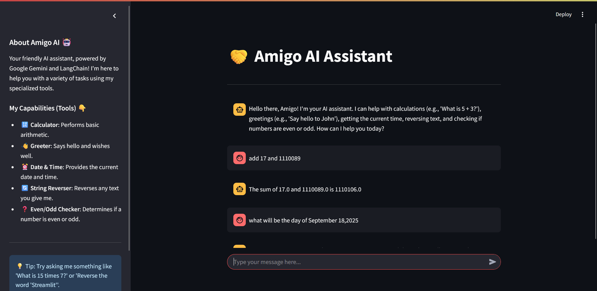

## 🤝 Amigo AI Chatbot

Amigo AI is a friendly and interactive chatbot built with Streamlit, powered by Google Gemini models, and orchestrated using LangChain. This assistant is designed to perform various helpful tasks through specialized tools, offering a conversational and intuitive user experience.

## Live Link

 
    

## UI

## ✨ Features

The Amigo AI Chatbot comes equipped with the following capabilities:

🔢 Calculator: Perform basic arithmetic operations (addition, subtraction, etc.).

👋 Greeter: Get a friendly greeting and well wishes.

⏰ Date & Time: Instantly fetch the current date and time.

🔄 String Reverser: Reverse any text or word you provide.

❓ Even/Odd Checker: Determine if a given number is even or odd.
    
## 💬 How to Interact with the Chatbot

Simply type your queries into the chat input box at the bottom of the screen. The chatbot will intelligently use its available tools to respond to your requests.

Examples you can try:

"What is 123 + 456?"

"Say hello to Amigo!"

"What time is it right now?"

"Reverse the word 'Python'."

"Is 25 an even or odd number?"

Enjoy chatting with your Amigo AI Assistant!
